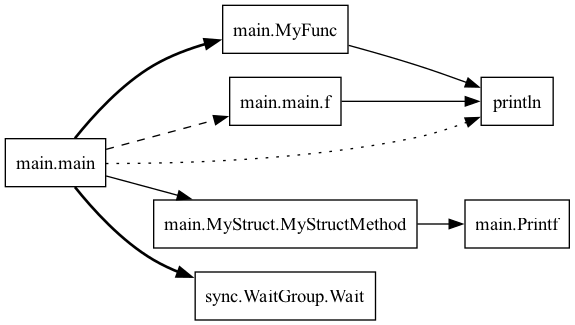
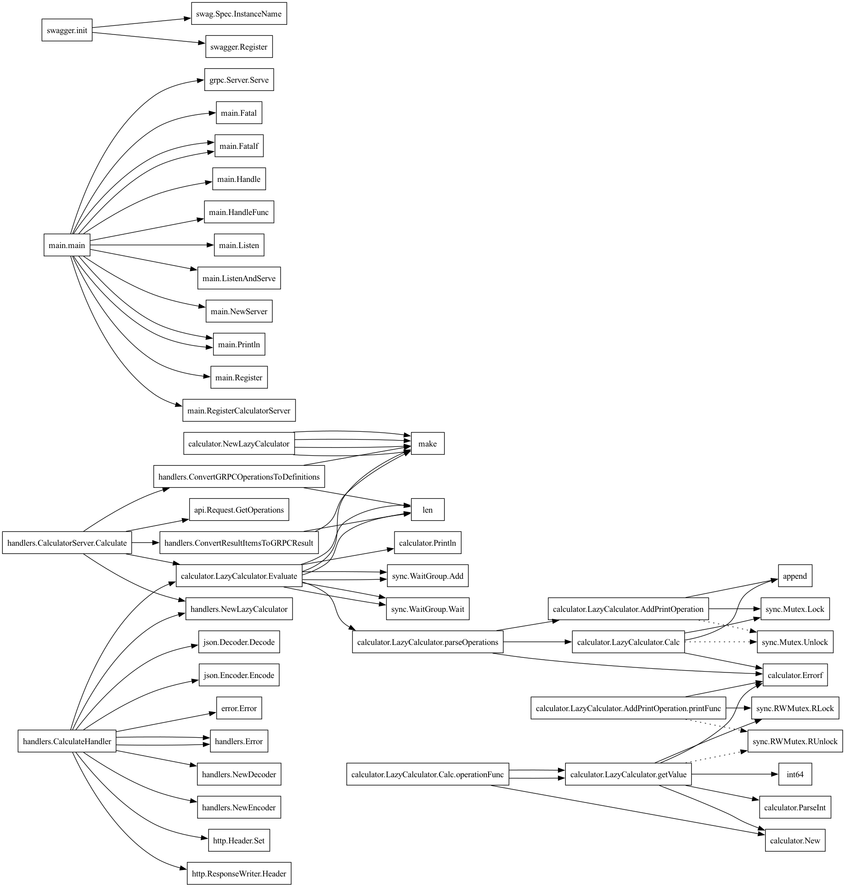
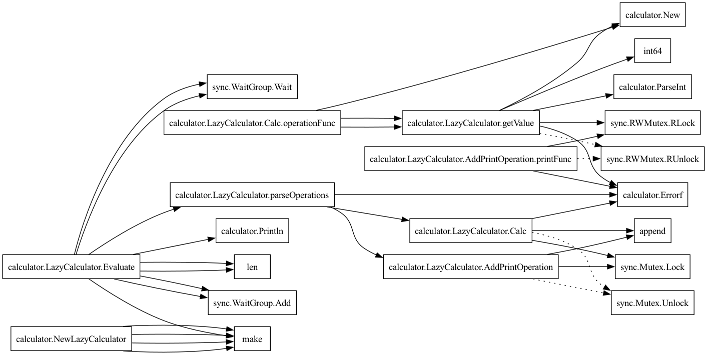

# Go Code Analyzer

## Логика работы

---

## Структура проекта
````
.
├── cmd
|   └── analyzer — запуск проекта
├── internal
|   └── graph_builder — логика построения графа вызовов
|       ├── graph.go — содержит собственно сам граф и его методы
|       └── parser.go — содержит парсинг и обработку всего проекта
├── .gitignore
├── go.mod
├── go.sum
└── README.md
````
---

## Аргументы запуска
* `-exclude=` — список пакетов, которые не нужно обрабатывать
* `-include=` — список пакетов, которые нужно обрабатывать

### Примеры запуска
Выполните сборку проекта командой `go build -o callgraph cmd/analyzer/main.go`

* Вывод графа вызовов в терминал: `./callgraph ./path/to/project`.
* Сохранение графа вызовов в `.dot` файл: `./callgraph ./path/to/project > graph.dot`.
* Сохранение графа вызовов в `png` формате: `./callgraph ./path/to/project | dot -Tpng -o callgraph.png` 
(необходима утилита Graphviz)


## Примеры выполнения
1. Простейший пример, содержащий все виды вызовов
    * Код программы
    ```go
    package main

    import (
        "fmt"
        "sync"
    )

    type MyStruct struct {
        Type string
    }

    func (ms *MyStruct) MyStructMethod() {
        fmt.Printf("MyStruct type: %s\n", ms.Type)
    }

    func MyFunc() {
        println("call func")
    }

    func main() {
        defer println("deferred")

        f := func() { println("closure") }

        go MyFunc()

        wg := &sync.WaitGroup{}
        go wg.Wait()

        f()

        ms := &MyStruct{"type"}
        ms.MyStructMethod()
    }
    ```
    * Результат работы программы
    
2. Анализ репозитория https://github.com/coIorbIind/calculator
    * Результат анализа с помощью команды `./callgraph -exclude=api ./calculator | dot -Tpng -o calculator_r1.png`
    
    * Результат анализа с помощью команды `./callgraph -include=calculator ./calculator | dot -Tpng -o calculator_r2.png`
    
